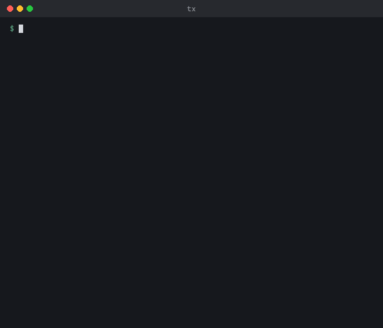
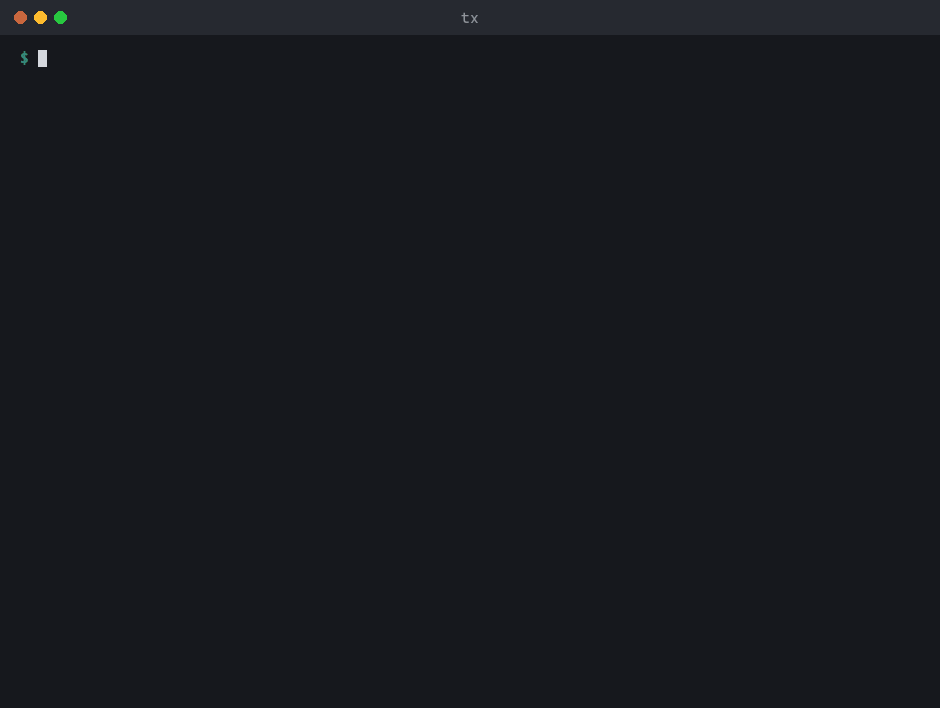
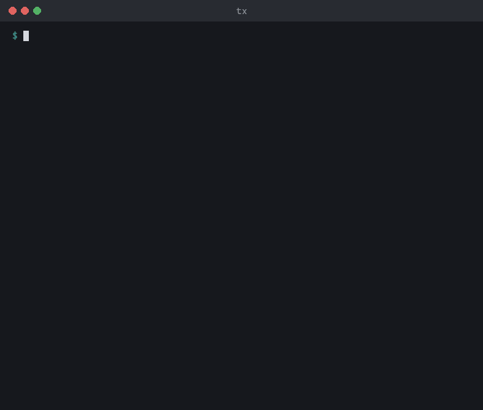

# tomix

A command-line interface for semantic models. Browse, edit, lint, diff, and
deploy tabular models the way you work with files: `ls`, `get`, `find`, `rm`,
`mv` — against a TMDL folder, a `.bim` file, an XMLA endpoint, or a Power BI
Desktop instance running on your machine.

Semantic models are code. They deserve tooling that works where code lives:
in a terminal, in scripts, in CI, in a diff.



Read the full [documentation](https://bgarcevic.github.io/tomix-cli/) for
installation, quickstart guides, command references, and scripting examples.

```
$ tx connect ./samples/basic-tmdl
Model: basic-tmdl
  CL: 1601
  tables: 3  measures: 4  relationships: 2  roles: 0

Active: ./samples/basic-tmdl

$ tx ls --type table --paths-only
Customers
Products
Sales

$ tx find "SUM" --in expressions
╭───────────────────┬─────────┬────────────┬───────┬──────╮
│ Path              │ Type    │ Property   │ Match │ Line │
├───────────────────┼─────────┼────────────┼───────┼──────┤
│ Sales/Total Sales │ Measure │ Expression │ SUM   │ 1    │
╰───────────────────┴─────────┴────────────┴───────┴──────╯
1 match(es)

$ tx bpa run
BPA analysis · basic-tmdl

● ERROR  2 rules · 12 objects
  ×7  Do not summarize numeric columns
      NUMERIC_COLUMN_SUMMARIZE_BY · Formatting · fixable
  ×5  Provide format string for measures
      PROVIDE_FORMAT_STRING_FOR_MEASURES · Formatting

● WARNING  2 rules · 5 objects
  ×4  Hide foreign keys
      HIDE_FOREIGN_KEYS · Formatting · fixable
  ×1  Model should have a date table
      MODEL_SHOULD_HAVE_A_DATE_TABLE · Performance

────────────────────────────────────────────────────────────────────────────────
✗ 12 errors · 5 warnings in 4 of 27 rules · 23 passed · 133ms

Fix 11 findings:  tx bpa run --fix --save
Details:          tx bpa run --details
One rule:         tx bpa run --rule NUMERIC_COLUMN_SUMMARIZE_BY

$ tx deploy --server MyWorkspace --database basic-tmdl
OK Deployed basic-tmdl to MyWorkspace (4.1s)
```

Every command prints JSON with `--output-format json`, so the output of any
command can become the input of your next script. `ls`, `get`, `query`,
`refresh`, `save`, and `vertipaq` also print CSV, and `get` can emit
the model formats too (`tmdl`, `bim`, `tmsl`).
The [samples](samples/) folder also contains a full PBIP model if you want
something more realistic than `basic-tmdl` to explore.

Lint a model and let `bpa` fix what it can:



Batch edits in a staging area, commit them together, and diff against the
released model:



## Install

Standalone binary, no runtime required:

```sh
# Linux / macOS
curl -LsSf https://raw.githubusercontent.com/bgarcevic/tomix-cli/main/install/install.sh | sh

# Windows
powershell -ExecutionPolicy ByPass -c "irm https://raw.githubusercontent.com/bgarcevic/tomix-cli/main/install/install.ps1 | iex"
```

If you have the .NET SDK: `dotnet tool install -g Tomix.Cli`. Archives for six
platforms are on the [releases page](https://github.com/bgarcevic/tomix-cli/releases);
checksums included.

Connecting to a locally running Power BI Desktop instance (`--local`) is
Windows-only. Everything that operates on TMDL/BIM files works everywhere.

### Updating

```sh
tx update --check   # preview: latest version + release notes, breaking changes flagged
tx update           # update in place (standalone binary or dotnet global tool)
```

`tx update` detects how tx was installed: a standalone binary is replaced
in place after checksum verification against the release's `checksums.txt`;
a dotnet global tool runs `dotnet tool update -g Tomix.Cli`. `--check` exits 0
whether or not an update exists (a failed check — no network, no releases —
exits 1); scripts should read `.data.updateAvailable` from
`tx update --check --output-format json`.

tx also checks for new releases in the background at most once per 24 hours
and prints a short notice on stderr when one is available. It never delays a
command and is suppressed in CI and for JSON/CSV output. Opt out entirely with
`tx config set updateCheck false` or `TOMIX_NO_UPDATE_CHECK=1`.

## Commands

Discover: `summary` (where a model lives and what it contains), `ls`, `get`,
`find`, `deps`, `query` (run DAX/DMV queries against a live model)
Modify: `add`, `set`, `mv`, `rm`, `replace`, `format` (DAX and M, via the
formatter APIs), `interactive` (alias `shell`: run commands against a model
held in memory, with undo, redo and transactions, then `save`), `serve` (the
same session for editors and agents, over JSON-RPC on stdin and stdout), `ui`
(share the session with a browser page and agents on localhost), `mcp` (the
session as MCP tools for AI agents such as Claude Code, Codex and Cursor).
Refresh policies use `get`/`set`/`rm` with `<table>/RefreshPolicy`;
`refresh --policy-only` applies a saved policy without loading data.
Connect: `connect` (interactive workspace/model pickers with `--remote`,
reconnect to a previous target with `--recent`), `deploy`, `refresh`,
`save`, `auth`
Validate: `bpa` (Best Practice Analyzer with auto-fix), `validate`, `test`
(DAX regression tests against a live model), `vertipaq` (storage statistics,
`.vpax` export/import), `diff`, `doctor`
Manage: `config`, `profile`, `init`, `completion`, `skills` (install the
agent skill for Claude Code and Codex), `stage` (mutations are
staged, then committed or discarded), `update` (self-update with
release-notes preview)

Working from a coding agent? `tx skills install` teaches Claude Code, Codex,
and other Agent Skills harnesses how to use `tx`; see
[Using tomix from your agent](https://bgarcevic.github.io/tomix-cli/guides/agents/).

`tx <command> --help` shows options and examples. `tx doctor` checks your
environment when something seems off.

Secrets never travel on the command line or in environment variables.
`tx auth login` takes a service-principal secret from a masked prompt, a file
(`--password-file`), or stdin — in CI:
`printf '%s' "$SECRET" | tx auth login -u $APP_ID -t $TENANT --password -`.
Saved credentials renew silently on Windows, macOS, and Linux.

## Scripting

Object paths are the pipeline currency. `ls --paths-only` emits one path per
line; most commands accept paths as input:

```sh
# Format every object whose expression mentions CALCULATE
tx find "CALCULATE" --in expressions --paths-only | xargs -I{} tx format --path "{}"

# Count columns per table
tx ls --type column --output-format json |
  jq '.data | group_by(.path | split("/")[0]) | map({(.[0].path | split("/")[0]): length}) | add'
```

Piped or redirected, text output is plain: tables keep one row per line instead of
wrapping, and borders and symbols are ASCII, so output greps cleanly and reads
correctly in Windows PowerShell 5.1. Use `--output-format json` when a script
parses the result.

`query` runs DAX or DMV against a live model, with DAX Studio-style performance
options: `--trace` (formula- vs storage-engine timings), `--cold` (clear the
cache first), and `--runs N` (benchmark, reporting Avg/Min/Max/StdDev). Timings
print to stderr, so
the rowset on stdout stays pipeable; with `--output-format json` they are folded
into the result document instead.

```sh
# Server timings for a measure (needs workspace/server admin)
tx query 'EVALUATE ROW("Sales", [Total Sales])' --trace

# Benchmark a heavy query cold, five runs
tx query --file heavy.dax --cold --runs 5
```

The trace-based options (`--trace`, `--cold`) require admin rights on
the endpoint; when unavailable they warn and the query still returns its rows.

Exit codes are documented in [docs/error-codes.md](docs/error-codes.md).
Errors go to stderr (as JSON if you pass `--error-format json`), data goes
to stdout.

## Status

This is a proof of concept under active development. The command surface is
settling but not settled; JSON field names and exit codes may still change
before 1.0.

If you try it and something breaks or reads wrong, an issue with the output
of `tx doctor` attached is genuinely useful at this stage.

## Contributing

Build and test with `dotnet build && dotnet test`, then run the CLI from
source with `./tx doctor` (`.\tx.ps1 doctor` on Windows) — no install step,
always reflects your working tree. The architecture is documented
in `CONTEXT.md` files throughout the tree — start with
[`src/Tomix.Cli/CONTEXT.md`](src/Tomix.Cli/CONTEXT.md). Color and output
conventions live in [`docs/cli-color-strategy.md`](docs/cli-color-strategy.md).
See [CONTRIBUTING.md](CONTRIBUTING.md) for the rest.

## License

[MIT](LICENSE). Third-party components and the provenance of the bundled BPA rules are documented in
[THIRD-PARTY-NOTICES.md](THIRD-PARTY-NOTICES.md).
