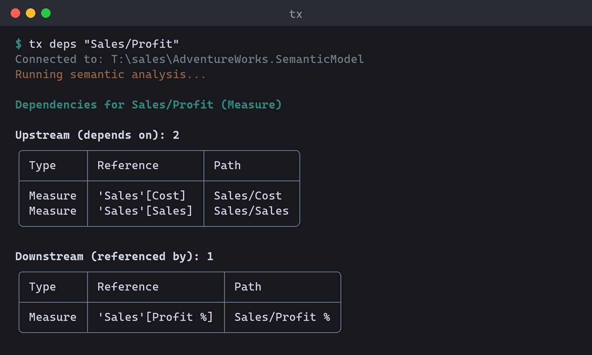

# Discover

Read-only commands for exploring a model. All of them work against the
[active connection](../guides/connections.md) or an explicit model argument,
and all print JSON with `--output-format json`. `get` is the one read command;
`ls` and `deps` are shortcuts into it. Lists, single objects, and `query` also
print CSV; a single object additionally emits `tmdl`, `bim`, and `tmsl`.

## `summary` — what is this model

```
tx summary [model]
```

Prints where the model lives and what it contains: its source (a file path,
or the workspace endpoint and model name), the on-disk format (`tmdl` or
`bim`) for local models, the compatibility level, culture, and default
storage mode, and object counts (tables, columns, measures, relationships,
roles, partitions, calculation groups, perspectives, cultures). A good first
command on an unfamiliar model, and a quick smoke test that it opens.

```
AdventureWorks Sales  Model

  source              ./samples/AdventureWorks Sales.SemanticModel
  format              tmdl
  compatibilityLevel  1606
  culture             en-US
  defaultMode         Import

  Contents
    tables             10
    columns            62
    measures           20
    relationships       9
    roles               0
    partitions         10
    calculationGroups   2
    perspectives        0
    cultures            1
```

The labels are the JSON keys, laid out like the [`get`](#get-read-model-objects)
view; the next-step hint goes to stderr and is hidden by `--quiet`.

```sh
tx summary                           # the active connection
tx summary ./model.tmdl
tx summary --output-format json      # counts under "counts"
```

## `get` — read model objects

`get` is the one read command. The path decides what comes back: a path that
names one object shows its properties, and a path that selects a set — a
wildcard, a container, or no path at all — lists every match. The selection
and analysis options below combine over the same path resolution, and
[`ls`](#ls-list-model-objects) and [`deps`](#deps-dependency-analysis) are
shortcuts for `get --ls` and `get --deps` / `get --unused`.

```
tx get [path] [model] [options]
```

| Path | Result |
|------|--------|
| `Sales`, `Sales/Amount`, `"'Sales'[Amount]"`, `"[Total Sales]"` | One object's properties. |
| `.` | The model root's properties. |
| `Sa*`, `Sales/*Amount`, `*/Amount` | Every match, as a list. |
| `Tables`, `Measures`, `Sales/Measures`, `Sales/Partitions` | Every object in the container, as a list. |
| *(omitted)* | The model's tables, as a list. |

| Option | Description |
|--------|-------------|
| `--query <property>` | Read just one property of one object (e.g. `--query expression`). |
| `-t, --type <type>` | Pick one object when the path matches several, or filter a list. Same vocabulary as `ls --type`. |
| `--all` | List every property of one object, including unset ones. Text output only; JSON and CSV always carry all. |
| `--ls` | List the objects the path selects, as a compact table. `tx get Sales --ls` lists Sales's children, like `tx ls Sales`. |
| `--where <prop=value>` | Keep objects whose property matches, case-insensitively. `*` is the only wildcard: `Name=*margin*` (contains), `Name=margin*` (starts with), `Name=*margin` (ends with), `Name=margin` (the whole value). Repeat to AND filters. The path is the scope; with no path the filter runs over the tables, so name a container (`Measures`) or pass `--type` to reach deeper. |
| `--deps [upstream\|downstream]` | Trace what one object uses and what uses it (default: both). |
| `--deep` | With `--deps`: walk the dependency chain recursively. |
| `--max-depth <n>` | With `--deps --deep`: how deep to walk (default: 10). |
| `--unused` | List measures and columns that nothing depends on, across the whole model (no path). |
| `--hidden` | With `--unused`: only unused objects that are hidden. |
| `--paths-only` | List one object path per line, ready for piping. |
| `--no-multiline` | List multi-line cell content on one line. Text output only. |

`--query` and `--deps` need a single object, so a wildcard or container path
fails with `TOMIX_SINGLE_OBJECT_REQUIRED`. Options that cannot apply together —
`--deps` with `--unused`, a listing option with `--deps`, `--deep` without
`--deps`, `--hidden` without `--unused` — fail with `TOMIX_USAGE`. A list
prints as text, JSON, or CSV; a single object additionally as `tmdl`, `bim`,
or `tmsl`; dependencies as text or JSON.

```sh
tx get                                          # the tables (same as tx ls)
tx get "Sa*"                                    # every table starting with Sa
tx get Sales/Measures                           # a container: Sales's measures
tx get Measures --where "Name=*margin*"         # measures whose name contains margin
tx get --type measure --where "Name=margin*"    # select a kind instead of a path
tx get Columns --where DataType=String --where IsHidden=true
tx get Sales --ls                               # Sales's children, as tx ls Sales
tx get "Sales/Total Sales" --deps               # what it uses and what uses it
tx get "Sales/Amount" --deps downstream --deep  # everything that depends on it
tx get --unused --hidden                        # prune candidates
```

`get` returns objects; to search property text and get the match sites back,
use [`find`](#find-search-across-the-model). Name filtering deliberately
overlaps between the two.

### One object

The text view shows what was authored. Properties still at their default are
left out, so a column reads as its data type, source, and the few settings
someone changed instead of 25 lines of `False` and blanks. Unset properties you
can change with `tx set` are listed on one `Not set:` line, and read-only
defaults are dropped. Multi-line DAX and M print as an indented block under
their key, and annotations and translations get their own sections:

```text
Sales/Profit  Measure

  description    Sales minus Cost.
  expression     [Sales] - [Cost]
  formatString   "$"#,0;("$"#,0);"$"#,0
  displayFolder  Core
  lineageTag     c892c8ee-eab9-4d1b-b4e8-80e9a996ea2e

  Not set: isHidden, dataCategory, isSimpleMeasure, sourceLineageTag
```

Pass `--all` to list every property: the header counts how many are set, defaults are dimmed (`—` for empty), and properties `tx set` cannot change are tagged `read-only`. `--output-format json`
and `csv` are unchanged by this: they always carry the full per-kind property set.

Each object kind has its own property set: measures include `expression`,
`formatString`, `detailRowsExpression`, and the KPI expressions; relationships
include their endpoint columns, cardinality, `crossFilteringBehavior`, and
`isActive`; roles include `modelPermission` and `rlsExpression`; shared
expressions include `expression`, `kind`, and `remoteParameterName`; DAX
functions include `expression` and `isHidden`. The model root has its own
path — `tx get .` reports the compatibility level, `culture`,
`defaultMode`, and the other model-level scalars (for object counts, see
[`summary`](#summary-what-is-this-model)). Object
annotations are appended as `annotation:<name>` entries in text and JSON
output, followed by translations as `translation:<culture>/<property>`
(the same token `tx set` takes). CSV keeps the fixed per-kind columns.

```sh
tx get "Sales/Total Sales"
tx get "Sales/Total Sales" --all
tx get "Sales/Total Sales" --query expression
tx get "Sales/Total Sales" --query annotation:PBI_FormatHint
tx get "Sales/Total Sales" --query translation:da-DK/caption
tx get "Relationships/rel-customers"
tx get "Expressions/Environment" --query expression   # a shared M parameter's value
tx get . --query culture                         # a model-level scalar
tx get Sales --output-format tmdl    # the object as TMDL
```

`-q` is the global `--quiet` flag, not a property shortcut — always pass the
property through `--query`. A `--query` that names no property of the object
fails with `TOMIX_PROPERTY_NOT_FOUND` and suggests the closest one; an unset
`annotation:` or `translation:` token reads back empty.

## `ls` — list model objects

Alias: `list`. A shortcut for [`get --ls`](#get-read-model-objects): both run
the same read pipeline and print identical output.

```
tx ls [path-filter] [model] [options]
```

| Option | Description |
|--------|-------------|
| `-t, --type <type>` | Filter by type: `table`, `measure`, `column`, `calculatedcolumn`, `hierarchy`, `level`, `partition`, `calculationitem`, `member`, `relationship`, `role`, `perspective`, `culture`, `datasource`, `kpi`, `tablepermission`, `calendar`, `expression`, `function`. `column` matches data and calculated columns; `calculatedcolumn` narrows to calculated ones. |
| `--paths-only` | One object path per line, ready for piping. |
| `--no-multiline` | Show multi-line cell content (e.g. measure expressions) on one line. Text output only. |

```sh
tx ls                                # the tables
tx list --type table --paths-only    # 'list' is an alias of 'ls'
tx ls Sales                          # a table's children (get Sales reads the table itself)
tx ls Sales/Measures                 # children of a container
tx ls Expressions                    # shared M expressions (parameters)
tx ls Functions                      # DAX user-defined functions
tx ls "Sa*"                          # wildcard filter
tx ls --type calculatedcolumn        # only calculated columns
```

## `find` — search across the model

```
tx find <pattern> [model] [options]
```

| Option | Description |
|--------|-------------|
| `--in <scope>` | Where to look: `names`, `expressions`, `descriptions`, `displayFolders`, `formatStrings`, `annotations`, `all` (default; annotations only when requested explicitly). |
| `-t, --type <type>` | Only search objects of this kind (same vocabulary as `ls --type`). |
| `--regex` | Interpret the pattern as a regular expression. |
| `--case-sensitive` | Match text exactly, including letter case. |
| `--paths-only` | One matching object path per line, ready for piping. |
| `--no-multiline` | Show multi-line match context on one line. Text output only. |

Searches every scope site `tx replace` can rewrite — including partition
expressions, KPI expressions, detail-rows and format-string definitions,
refresh-policy M, calculation-group selection expressions, RLS filter
expressions, shared M expressions, and DAX user-defined functions — so a
find preview is also a replace preview. Relationship
names are skipped (synthesized from endpoints, not authored text), but
relationship annotations are searched under `--in annotations`.

```sh
tx find "SUM" --in expressions
tx find "TODO|FIXME" --regex --in descriptions
tx find "Qty" -t measure --paths-only
```

## `deps` — dependency analysis

A shortcut for [`get --deps` / `get --unused`](#get-read-model-objects): both
run the same read pipeline and print identical output.

```
tx deps [path] [model] [options]
```

| Option | Description |
|--------|-------------|
| `--upstream` | Trace only what this object uses (`get --deps upstream`). |
| `--downstream` | Trace only what uses this object (`get --deps downstream`). |
| `--deep` | Walk the dependency chain recursively. |
| `--max-depth <n>` | How deep `--deep` walks (default: 10). |
| `--unused` | List measures and columns that nothing depends on. |
| `--hidden` | With `--unused`: restrict the list to unused objects that are hidden. |
| `-t, --type <type>` | Type to pick when the path matches several objects under a table. |



```sh
tx deps "Sales/Total Sales" --upstream
tx deps "Sales/Amount" --downstream --deep
tx deps --unused --hidden
```

## `query` — run DAX or DMV

```
tx query [query] [options]
```

Executes against a live model (the active remote connection, or
`-s`/`-d`). See [Output & scripting](../guides/scripting.md#querying-live-models)
for the performance-analysis workflow.

The query text can be passed positionally, via `--query`, `--file` (or
piped on stdin) — exactly one of the three. `-q` is the global `--quiet`
flag and is never query text; `query -q "EVALUATE …"` fails with
`TOMIX_QUIET_COLLISION` naming the mix-up.

Before a DAX query is sent, every table, column and measure it names is
checked against the model's metadata (already loaded with the connection, so
no extra round trip). A typo fails at once with `TOMIX_QUERY_UNKNOWN_REFERENCE`
and the closest name — `Did you mean 'Amount'?` — or, when nothing is close,
the table's columns or the model's tables. Names the query defines itself
(`DEFINE MEASURE`, `COLUMN`, `TABLE`, and columns built with
`SUMMARIZECOLUMNS`/`ADDCOLUMNS`) are understood. `--no-validate` skips the
check.

Querying needs only read access: the Viewer role with Build permission on the
model is enough, for `query` and for `test`. Reading the model's metadata needs write access (workspace
Admin, Member or Contributor), so with Build permission only the reference
check is skipped and the query is sent unchecked, and the commands that read
metadata (`ls`, `get`, `deps`, ...) fail with `TOMIX_METADATA_ACCESS_DENIED`.

| Option | Description |
|--------|-------------|
| `--query <text>` | Inline query (`-` = stdin). |
| `--file <file>` | Read the query from a file (`-` = stdin). |
| `--param <name=value>` | Query parameter, referenced as `@name` in DAX. Repeatable. |
| `--limit <n>` | Maximum rows to return. |
| `-o, --output-file <file>` | Write results to a file as json or csv. |
| `--trace [path]` | Server timings (formula vs storage engine); optional path dumps raw trace events. Needs write access to the model. |
| `--cold` | Clear the model cache (and run a warm-up query) before each run. Needs write access to the model; without it every run stays warm and `TOMIX_QUERY_COLD_UNAVAILABLE` says so. On Power BI / Fabric this empties the query caches but does not evict column data already in memory, so only the first run pays that load cost. |
| `--runs <n>` | Execute N times and report Avg/Min/Max/StdDev. |
| `--no-validate` | Skip the pre-flight checks: the EVALUATE/DEFINE/SELECT keyword check and the check that every table, column and measure the query names exists in the model. |

```sh
tx query 'EVALUATE ROW("Sales", [Total Sales])' --trace
tx query --file heavy.dax --cold --runs 5
```
