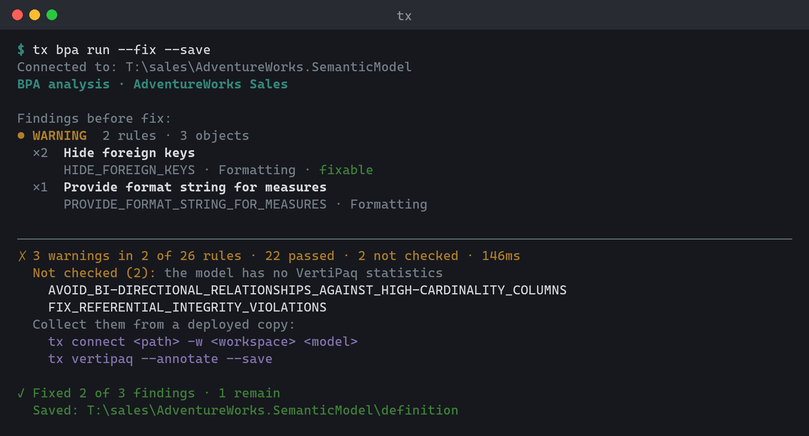

# Validate

Commands for checking model quality — locally, against a live model, and in
CI. See [Output & scripting](../guides/scripting.md#ci) for the CI-specific
flags.

## `bpa` — Best Practice Analyzer

```
tx bpa run [model] [options]
tx bpa rules <subcommand>
```

`bpa run` evaluates the model against a rule collection and reports findings
by severity; `--fix` applies auto-fixes where the rule provides one
(`FixExpression`).

Besides property assignments (`IsHidden = true`) and `Delete()`, a fix expression can
rewrite the object's DAX:

| Fix expression | Rewrite | Used by |
|----------------|---------|---------|
| `QualifyColumnReferences()` | `[Amount]` → `'Sales'[Amount]` | `DAX_COLUMNS_FULLY_QUALIFIED` |
| `UnqualifyMeasureReferences()` | `'Sales'[Total]` → `[Total]` | `DAX_MEASURES_UNQUALIFIED` |

Only the flagged references change; formatting and comments are kept. A reference the
rewrite cannot resolve for certain leaves the expression untouched and is reported under
fix errors instead. For example, a column name that exists in more than one table, a
name that also appears as a string literal (a column the expression builds with
`ADDCOLUMNS`), or a measure qualified with a table it does not belong to.



When fixes or rule-ignore changes are saved, the shared validation gate blocks
new model errors before writing. Use `--force` to save and report them anyway,
or `tx config set validateOnSave false` to disable the gate (default: on).

The default `standard` ruleset is a curated high-signal subset of the bundled
catalog — rules that catch broken models, expensive-at-scale patterns, and a
small core of consumer-experience checks. Use `--ruleset full` for the entire
bundled catalog (including style, advisory, and heuristic rules that fire on
most models).

The catalog grows through presets rather than through the default set: a
category whose rules would bury real findings on most models ships
default-off. Neither `standard` nor `full` includes a default-off category; its
own `--ruleset` preset (the category name in kebab case) opts in, and presets
combine with commas — for example `--ruleset standard,localization` once
localization rules ship. Localization is the first such category: on a
single-culture model, translation rules would report every visible object.

`standard` also drives the [`deploy`](connect.md#deploy-deploy-to-a-workspace) BPA gate, which blocks on
error-severity findings by default. Error severity is therefore reserved for
findings that mean the model is broken: a data column with no source column,
an expression-reliant object with no expression, invalid characters in a name
or description, `USERELATIONSHIP` against a table with row-level security, and
sort-by or hierarchy columns hidden from MDX (see
[IsAvailableInMdx](#isavailableinmdx)). Everything else in `standard` is
a warning or info that `bpa run` reports without blocking a deploy
(`deploy --bpa-fail-on warning` blocks on warnings too).

A few rules — high-cardinality bi-directional relationships, large unpartitioned
tables, and referential-integrity violations — read VertiPaq statistics. On a
model without them (no `Vertipaq_*` annotations), these rules are not run: `bpa run`
lists them under "Not checked" and doesn't count them as passed. In JSON they
appear in `missingVertipaqStatsRules` and as `MissingVertipaqStats` diagnostics.
They don't fail the run. To check them, write the statistics into the model first
with `tx vertipaq --annotate --save`. Statistics only exist on a deployed model, so this
works on a connected model, or on a local model connected in workspace mode (the
statistics are read from its deployed mirror). A model file with no deployed copy
can't be checked by these rules.

The bundled catalog is embedded in the application and cannot be overridden by
placing a file beside the executable. Use `--rules`, `bpa.rules`, model rule
annotations, or the `bpa rules` commands for explicit customization.

Models can carry their own rules: the `BestPracticeAnalyzer` annotation embeds
rule definitions directly, and the `BestPracticeAnalyzer_ExternalRuleFiles`
annotation lists rule files to load. Relative external-file paths resolve
against the model's folder (not the current directory), and Windows-style
separators (`..\.devops\bpa-rules.json`) work on every platform. When the same
rule ID appears in more than one source, the higher-precedence source wins:
ruleset < user rules (the [rule-source chain](#rule-sources)) < external files
< model-embedded — so a model's own rules always override the ruleset copy.
Among multiple external files, earlier entries in the annotation win. To detach
a model from an external rule file, remove the annotation:

```sh
tx set . --set annotation:BestPracticeAnalyzer_ExternalRuleFiles= --save
```

| Option | Description |
|--------|-------------|
| `-r, --rules <file>` | BPA rule files or URLs, as JSON. |
| `--ruleset <name>` | Standard ruleset: `standard` (curated default), `full`, `microsoft`, `microsoft-it`, `microsoft-ja`, `microsoft-es`, or a default-off category preset. Combine presets by repeating the option (`--ruleset standard --ruleset full`) or with commas; in PowerShell, quote a comma list (`'standard,full'`). |
| `--rule <id>` | Run only specific rule(s) by ID. |
| `--path <path>` | Limit analysis to matched objects (literal names, wildcards, or paths). |
| `--errors` / `--warnings` / `--info` | Show only rules of that severity (combinable). |
| `--fail-on <threshold>` | Failure threshold: `error` (default) or `warning`. Rules that cannot be evaluated count as error-severity findings and block under either threshold. |
| `--fix` | Fix violations whose rules provide a fix expression. Destructive `Delete()` fixes are skipped unless `--allow-delete` is set. |
| `--allow-delete` | With `--fix`: also apply destructive `Delete()` fixes that remove model objects. Reference tracking cannot see report visuals or external consumers, so review staged changes before deploying. |
| `--save` / `--save-to <path>` | Persist the model after applying fixes. Without these (or `--stage`), `--fix` only previews. |
| `--details` / `--full` | Show full guidance per rule / list every affected object. |
| `--no-multiline` | Show each rule's guidance on one line. Text output only. |
| `--no-model-rules` / `--no-defaults` | Skip rules embedded in the model / leave the selected standard ruleset out. |
| `--allow-external-rules` | Also load remote (URL) rule files referenced by the model's rule annotations. Skipped by default so a model file cannot make `tx` fetch arbitrary URLs. |
| `--ci <github\|vsts>` | Print CI log-group commands to stderr. |
| `--trx <path>` | Write results to a `.trx` test-run file. |

```sh
tx bpa run
tx bpa run --errors
tx bpa run --fix          # preview the fixes
tx bpa run --fix --save
```

Text output groups findings by severity. Each rule shows its object count, its name,
and a line with its ID, its category and whether it is `fixable`. `--details` adds the
guidance and lists the affected objects one per line. The summary line counts the
findings and shows how many of the evaluated rules passed; rules that were not
checked for lack of VertiPaq statistics are counted separately. Next-step commands are
printed ready to copy on stderr, reusing your model path and rule options. After
`--fix --save` (or `--stage`), the output shows how many findings were fixed and remain,
and whether the result was saved or staged. The rules are evaluated again after
fixing, and the exit code and `--fail-on` apply to the findings that remain, so a run
that fixes every blocking finding exits `0`. JSON reports this as `remaining`.

`--fix` without `--save`, `--save-to`, or `--stage` previews the fixes without changing the model. Each pending fix is
listed with its rule and, for a property fix, the value before and after
(`IsHidden: "false" → "true"`); the summary says how many findings the fixes would
leave. Because nothing changed, the exit code and `--fail-on` apply to the model as it
is. JSON sets `preview` and `status: "preview"`, keeps `fixesApplied` at `0`, and adds
`fixesPending`, `wouldRemain`, and a `fixes` array (`ruleId`, `objectType`,
`objectPath`, `action` of `set` or `delete`, `property`, `before`, `after`), so CI can
diff a preview. With `--save` or `--stage`, `fixes` lists the fixes that were applied.

`bpa run --fix --allow-delete --save` (or `--save-to`, `--stage`) deletes model objects,
so it asks for confirmation; `--revert` (drops staged work) asks too. A preview never asks. Pass `--yes` to skip
the prompt in scripts.

`bpa rules` manages rule collections:

| Subcommand | Description |
|------------|-------------|
| `bpa rules list` | List the rules in effect, once per rule ID, grouped by category, with each rule's severity, scope, status, and whether it is `fixable`. Includes the rules in your config-dir `bpa-rules.json` (source `user`). With a model (or, when none is named, a local active connection), also lists the model's embedded and external-file rules (remote URLs are reported, not fetched) and any rule-load diagnostics. A rule the model ignores shows as `ignored (model)`, one you ignore with `--user` as `ignored (you)`, and one ignored both ways as `ignored (you, model)`. |
| `bpa rules show <rule-id> [model]` | Show one rule in full: description, reference link, source, scope, expression, and fix expression. Accepts `--ruleset` and `--no-defaults` like `list`, and like `list` uses a local active connection when no model is named. An unknown ID fails with `TOMIX_BPA_RULE_NOT_FOUND` and suggests IDs that contain what you typed. |
| `bpa rules ignore <rule-id> [model]` / `bpa rules unignore <rule-id> [model]` | Add or remove a rule on the model's ignore list. With `--user`, ignore it (or stop) just for you, on this machine, for every model. See [Ignoring rules](#ignoring-rules). |
| `bpa rules add [model] --id <id> ...` | Add a custom rule to your rules file, or to the model's rules with a model. Needs `--name`, `--scope`, and `--expression`; see [Authoring rules](#authoring-rules). |
| `bpa rules set <rule-id> [model] ...` | Change fields of a rule in your rules file or the model's rules. |
| `bpa rules remove <rule-id> [model]` | Delete a rule from your rules file or the model's rules. |
| `bpa rules init` | Create an empty rules file. |

`ignore` checks the rule ID first, so a typo can't silently turn off
nothing. The ID must belong to the bundled catalog (every ruleset), your config-dir
`bpa-rules.json`, the selected `--rules-file`, or, for `ignore`, the model's embedded
or local external rules. An unknown ID fails with `TOMIX_BPA_RULE_NOT_FOUND` and suggests
close matches. If a rule source can't be read (for example, a remote rule file,
which is never fetched here), the check is skipped. Pass `--allow-unknown` to use an
ID anyway. `unignore` accepts any ID, so you can always clean up an entry
for a rule that no longer exists.

`bpa rules --rules-file <file>` points the subcommands at a BPA rules JSON
file. `bpa rules list` narrows what is listed:

| Option | Description |
|--------|-------------|
| `--ruleset <name>` | Standard BPA ruleset to list: `standard`, `full`, `microsoft`, `microsoft-it`, `microsoft-ja`, `microsoft-es`. Repeat it to combine presets. |
| `--no-defaults` | Leave the built-in ruleset out of the listing. |
| `--ignored` | List only ignored rules, whether you or the model ignores them. |
| `--all` | Include ignored rules in the listing. |

```sh
tx bpa rules list
tx bpa rules list model.bim --all
tx bpa rules show HIDE_FOREIGN_KEYS
```

### IsAvailableInMdx

The catalog has two rules about a column's `IsAvailableInMdx` property, and
they point the same way:

- **Set IsAvailableInMdx to true on necessary columns**
  (`SET_ISAVAILABLEINMDX_TO_TRUE_ON_NECESSARY_COLUMNS`, error, in `standard`).
  A column that sorts another column, is sorted by one, is a hierarchy level, or
  is used in a variation needs its attribute hierarchy. Without it, queries
  fail, so the deploy gate blocks on it.
- **Set IsAvailableInMdx to false on non-attribute columns**
  (`ISAVAILABLEINMDX_FALSE_NONATTRIBUTE_COLUMNS`, warning, `--ruleset full` only).
  A hidden column that is none of those things doesn't need an attribute
  hierarchy, and turning it off saves processing time and memory. It is an
  optimization, so it never blocks a deploy.

The second rule skips every column the first rule protects, so no column is
flagged by both, and applying its fix never trips the first rule. A tested
guarantee keeps it that way. Some community rule sets have a simpler variant,
"false on every hidden column", with no exceptions. Don't combine that
variant with these rules: it turns off hierarchies that sort-by columns and
hierarchy levels need, so the two rules contradict each other on those
columns.

### Rule sources

`bpa run` loads rules from a chain of sources. Each source is optional:

1. The `--ruleset` presets (`standard` unless you choose another).
2. Your config-dir `bpa-rules.json`, which `bpa rules add` writes.
3. The `bpa.rules` config key: files or URLs separated by `;`. Relative paths
   resolve against the config directory (`~/.tomix`, or `$TOMIX_CONFIG_DIR`).
4. The `TOMIX_BPA_RULES` environment variable, in the same format. Use it in CI
   pipelines. Relative paths resolve against the working directory.
5. `--rules` on the command line.
6. The model's own rule annotations (see below).

```sh
tx config set bpa.rules "team/bpa-rules.json;https://example.com/org-rules.json"
TOMIX_BPA_RULES=.devops/bpa-rules.json tx bpa run .
```

When two sources define the same rule ID, the later source wins, so the
command line overrides the pipeline, and the pipeline overrides your config.
A missing file or failed download stops the run with
`TOMIX_BPA_RULES_LOAD_FAILED` and names the setting that pointed at it.

The other commands read the same settings:

- `bpa rules list` and `show` list the rules from `bpa.rules` and
  `TOMIX_BPA_RULES` with source `bpa.rules` or `TOMIX_BPA_RULES`. A source that
  can't be loaded is reported as a diagnostic, and the listing still shows
  every other source.
- `bpa rules list` shows each rule ID once, from the source that wins by the
  same order as `bpa run`. A team or model rule that replaces another source's
  copy says so (`overrides standard`; JSON `overrides`). `bpa rules show` still
  prints every source's copy, so you can compare an override with the original.
- `bpa rules ignore` accepts IDs from their local files.
- The `deploy` BPA gate checks the `standard` ruleset, then `bpa.rules`,
  `TOMIX_BPA_RULES`, and `--bpa-rules`, with the same override order. It
  doesn't load your personal config-dir `bpa-rules.json` or the model's rule
  annotations.

Every run says where its rules came from, so a pipeline log shows what was
checked:

```text
Rules loaded: 29 from standard ruleset (26) + .devops/bpa-rules.json via TOMIX_BPA_RULES (2) + model annotations (1)
```

Each count is the number of rules that source contributed after overrides.
When a higher-precedence source replaced some of them, the count says so: with
`--ruleset standard,full`, the line reads `standard ruleset (0; all 26
overridden) + full ruleset (70)`. In JSON, the same information is in
`ruleSources`: one entry per source with `name`, `kind` (`machine`, `user`,
`external`, or `modelEmbedded`), `origin` (`ruleset`, `userFile`, `config`,
`environment`, `option`, or `model`), `rules`, and `overridden`.

### Ignoring rules

`bpa rules ignore` switches a whole rule off at one of two levels:

| | `ignore` / `unignore` | `ignore --user` / `unignore --user` |
|---|---|---|
| Applies to | One model, for everyone who uses it | You, on this machine, for every model |
| Stored in | The model's `BestPracticeAnalyzer_IgnoreRules` annotation (shared with Tabular Editor); needs `--save` like any model change | `bpa-disabled.json` in the config directory; takes effect at once |

```sh
tx bpa rules ignore HIDE_FOREIGN_KEYS --save
tx bpa rules ignore HIDE_FOREIGN_KEYS --user
```

`--user` can't be combined with a model or with `--save`, `--stage`, and the
other save options; that fails with `TOMIX_OPTION_CONFLICT`. `bpa rules disable`
and `enable`, the earlier spellings of `ignore --user` and `unignore --user`, still
work but are no longer listed in help.

A rule runs only when neither level ignores it. Unignoring at one level leaves
the other in force, so `unignore` checks the other level and warns:

- `unignore --user` warns with `TOMIX_BPA_RULE_STILL_IGNORED_BY_MODEL` when your
  active local model still ignores the rule, and shows the `unignore` command
  to run.
- `unignore` warns with `TOMIX_BPA_RULE_STILL_IGNORED_BY_USER` when you still
  ignore the rule, and shows the `unignore --user` command to run.

`unignore --user` doesn't add a rule to the ruleset. For a rule that's only in
`--ruleset full` (or in a default-off category), it warns with
`TOMIX_BPA_RULE_NOT_IN_RULESET` and names the `--ruleset` value that runs it.

`bpa rules list` shows both levels, and `--ignored` lists rules ignored at
either one. In JSON, each rule has `ignoredByUser` and `ignoredByModel`
booleans next to `status`, which keeps its earlier single value (`disabled` for
a rule you ignore, which wins over `ignored`). The summary counts a rule
ignored both ways in both `disabled` and `ignored`.

`bpa run` counts skipped rules in `disabledRules`. The JSON also lists them by
level in `userIgnoredRules` and `modelIgnoredRules`; a rule ignored both ways
is in both lists. `ignoredRules` counts findings on individual objects that an
object-level ignore annotation suppresses, not whole rules.

### Authoring rules

`bpa rules add`, `set`, `remove`, and `init` edit a rules JSON file: your config-dir
`bpa-rules.json` (`~/.tomix`, or `$TOMIX_CONFIG_DIR`), which `bpa run` loads on every
run, or the file named by `bpa rules --rules-file <file>`. Remote rule files can't be
edited (`TOMIX_BPA_RULES_FILE_REMOTE`). Fields tx does not know about are kept as they are.

| Option | Description |
|--------|-------------|
| `--id <id>` | Rule ID (`add` only; `set` and `remove` take it as an argument). An ID the file already has fails with `TOMIX_BPA_RULE_EXISTS`. |
| `--name <text>` | Rule name shown in results. Required for `add`. |
| `--scope <types>` | Object types the rule checks, comma-separated, for example `"Measure, CalculatedColumn"`. Required for `add`. Unknown types fail with `TOMIX_BPA_RULE_INVALID_SCOPE`, which lists the valid ones. |
| `--expression <expr>` | Rule expression; an object that matches it is a violation. Required for `add`. |
| `--severity <level>` | `error`, `warning`, or `info` (or `3`, `2`, `1`). Defaults to `warning`. |
| `--category <name>` | Category the rule is grouped under. Defaults to `Custom`. |
| `--description <text>` | Guidance shown with violations. |
| `--fix-expression <expr>` | Fix that `bpa run --fix` applies. |

With `set`, pass only the fields to change; an empty value (`--description ""`)
removes an optional field. `add` creates the file when it doesn't exist; `set` and
`remove` fail with `TOMIX_BPA_RULES_FILE_NOT_FOUND`. `init` won't replace an
existing file unless you pass `--overwrite`. Built-in rules can't be edited or removed.
Turn one off with `bpa rules ignore`, or override it by adding a rule with the same ID.

```sh
tx bpa rules add --id MEASURE_DESCRIPTIONS --name "Measures need a description" --scope Measure --expression "string.IsNullOrWhitespace(Description)"
tx bpa rules set MEASURE_DESCRIPTIONS --severity error
tx bpa rules remove MEASURE_DESCRIPTIONS
tx bpa rules --rules-file team-rules.json init
```

#### Rules that ship with the model

Give `add`, `set`, or `remove` a model (as the argument, or with `--model`, `--recent`,
or `--server`) and they edit the model's `BestPracticeAnalyzer` annotation instead of a
file. Those rules travel with the model, and `bpa run` and `bpa rules list` pick them up
as source `model-embedded`. The same field checks apply, and fields tx does not know
about are kept. A model and `--rules-file` together fail with
`TOMIX_BPA_RULES_TARGET_CONFLICT`.

The edit is a model mutation, like `bpa rules ignore`: nothing is written until you pass
`--save` (or `--stage`), and `--save-to`, `--serialization`, `--revert`, `--no-sync`, and
`--force` work as they do for `set`. Removing the last rule removes the annotation.
Rules found only under the old misspelled `BestPractizeAnalyzer` key are moved to the
correct key on the first edit. `init` only creates files.

```sh
tx bpa rules add . --id MEASURE_DESCRIPTIONS --name "Measures need a description" --scope Measure --expression "string.IsNullOrWhitespace(Description)" --save
tx bpa rules set MEASURE_DESCRIPTIONS . --severity error --save
tx bpa rules remove MEASURE_DESCRIPTIONS . --save
```

The BPA gate also runs automatically on `deploy` (`--skip-bpa` to bypass,
`--fix-bpa` to auto-fix first, `--bpa-rules` to point at specific rule files,
`--bpa-fail-on` to lower the blocking threshold to warnings — errors block by default).
The deploy gate loads `bpa.rules` and `TOMIX_BPA_RULES` (see [Rule sources](#rule-sources))
and honors `bpa rules ignore --user` for the rules it loads. `bpa run` also loads your
config-dir `bpa-rules.json` and the model's rules, so the commands may report different findings.
A rule that cannot be compiled or evaluated is itself an error-severity finding
("rule could not be evaluated: \<reason\>"), so a typo in a rule expression fails
`bpa run` and the gates instead of silently skipping the rule.
On `save`, BPA runs only when `--fix-bpa` is passed; rules that cannot be
evaluated block the save even when other fixes were applied.
The gate never applies
destructive `Delete()` fixes — those are only available via
`bpa run --fix --allow-delete`.

## `validate` — DAX and relationship integrity

```
tx validate [model] [options]
```

Offline analysis runs on every DAX-bearing expression (measures, calculated
columns/items/tables, role filters, secondary measure expressions). Syntax is
checked first: illegal characters, unterminated string/table/bracket literals
and block comments, and unbalanced parentheses or braces are reported as
`DAX0004`/`DAX0005` errors. When those pass, the DAX parser reports its first
grammar error: a missing comma or leftover text (`DAX0007`), a missing operand
(`DAX0008`), or a `VAR` without `=` or `RETURN` (`DAX0009`). When an expression's syntax is broken, its
reference checks are skipped, since a never-closed bracket makes everything
after it read wrong. Syntactically valid expressions then get the offline
reference checks (`DAX0001`–`DAX0003`, see [error codes](../error-codes.md)).

In text output each finding shows the offending expression line under its
message, syntax-highlighted when it came from DAX; `--no-multiline` collapses
the cell back to one line. Every issue carries a severity: `--output-format
json` includes it as a string (`"severity": "Error"` / `"Warning"`) on each
issue, CI annotations emit errors as errors and warnings as warnings (the run
still exits `1` only for errors), and the TRX projection maps each issue's
severity to its test outcome.

| Option | Description |
|--------|-------------|
| `--ci <github\|vsts>` | Print CI log-group commands to stderr so findings annotate the PR. The text table is then printed without wrapping (also under Azure Pipelines without `--ci`). |
| `--trx <path>` | Write results to a `.trx` test-run file. |
| `--errors-only` | Only show errors. |
| `--no-warnings` | Leave out analyzer warnings. |
| `--server-only` | Only show errors reported by the connected server. |
| `--no-multiline` | Show multi-line cell content on one line. Text output only. |

```sh
tx validate
tx validate --ci github
tx validate --trx results.trx
```

The banner names the model being validated: the TOM database name, falling
back to the Fabric `.platform` displayName, then to the file/folder name —
so a nameless TMDL folder still shows its own name instead of `(unnamed)`.

```console
$ tx validate ./samples/basic-tmdl
Validating...
Validating: basic-tmdl

No validation errors found.
```

## `test` — DAX regression tests

```
tx test [path] [options]
```

Runs DAX regression tests against a live model and exits `1` on any mismatch,
so a pipeline can block a merge when a query result drifts. Each test is a
`.dax` file paired with a sibling `<name>.expected.json` snapshot; `path` is a
single test file or a directory searched recursively for `.dax` files
(default: the current directory). Test names are the file paths relative to
`path`, without the extension (`totals/sales-by-region`).

| Option | Description |
|--------|-------------|
| `--update` | Record mode: run each query and (re)write its `.expected.json` from the actual result. Byte-identical snapshots are left untouched. |
| `--filter <pattern>` | Run only tests whose name matches a `*` wildcard pattern (case-insensitive). |
| `--param <name=value>` | Query parameter applied to every test, referenced as `@name` in DAX. Repeatable. |
| `--max-rows <n>` | Per-query row cap; a query exceeding it fails as an error (default: `10000`). |
| `--ci <github\|vsts>` | Print CI log-group commands to stderr so failures annotate the PR. |
| `--trx <path>` | Write results to a `.trx` test-run file. |

Like `query`, tests execute on a **deployed model** (XMLA) or a local
instance — never on TMDL/BIM files. Target the model with `-s <workspace>
-d <model>` or the active session. Read access is enough: the Viewer role
with Build permission on the model.

**Workflow.** Add a test by writing a `.dax` file (any `EVALUATE` query),
then record its snapshot:

```sh
tx test ./tests --update -s MyWorkspace -d MyModel   # record snapshots
tx test ./tests -s MyWorkspace -d MyModel            # verify: all PASS, exit 0
```

A test without a snapshot fails the run as `MISS` (a new test must not
silently pass); a result that drifts from its snapshot fails as `FAIL` with a
difference table. Accept an intentional change by re-running `--update` and
committing the snapshot diff — the git diff *is* the review artifact.

The snapshot stores column names/types and all cell values as canonical
invariant strings (`null` = DAX `BLANK()`), plus a hash of the query text
used to hint when a failing test's query changed since recording:

```json
{
  "version": 1,
  "querySha256": "9f2c…",
  "columns": [
    { "name": "Sales[Region]", "type": "string" },
    { "name": "[Total Sales]", "type": "decimal" }
  ],
  "rows": [
    ["East", "1234.50"],
    ["West", null]
  ]
}
```

Rows compare **in order** — always end test queries with `ORDER BY` so
results are deterministic. Keep rowsets small and stable (aggregates,
`TOPN` over ordered sets); one `EVALUATE` rowset per file.

```sh
tx test ./tests
tx test ./tests/totals/sales.dax --update
tx test ./tests --filter "totals/*" --trx results.trx --ci vsts
```

## `vertipaq` — storage statistics

```
tx vertipaq [table] [options]
```

VertiPaq Analyzer-style storage statistics for a live model, with `.vpax`
export/import for offline analysis.

| Option | Description |
|--------|-------------|
| `--tables` / `--columns` / `--relationships` / `--partitions` / `--all` | Which view(s) to show (`--columns` is the default). |
| `--detail` | Extra columns: data/dictionary/hierarchy size breakdown, encoding, segments. |
| `--stats` | Model-level storage summary. |
| `--top <n>` | Limit each view to the N largest rows. |
| `--fields <list>` | Comma-separated fields to display (single view; text/csv only). |
| `--export <file.vpax>` | Export statistics to a `.vpax` file. |
| `--import <file.vpax>` | Analyze a previously exported `.vpax` offline (no connection needed). |
| `--obfuscate` | Mask names and expressions in the export; a private `.dict` dictionary keeps the mapping. |
| `--annotate` | Write statistics into the model as `Vertipaq_*` annotations (preview unless `--save`). |
| `--force` | With `--annotate --save`, write despite newly introduced validation errors and report them. |

```sh
tx vertipaq
tx vertipaq Sales --detail
tx vertipaq --stats --all --top 10
tx vertipaq --export stats.vpax
tx vertipaq --import stats.vpax --relationships
```

## `diff` — compare two models

```
tx diff <left> <right>
```

Compares two models (TMDL folders or `.bim` files) and shows structural
differences. Exit codes are CI-friendly: `0` = identical, `1` = differences
found, `2` = error.

When one side is a live database, engine-computed state is ignored so that comparing
source files against a processed model reports only authored changes. An inferred measure
data type present on only one side, calculated-table columns present on only one side,
and data type differences between calculated-table columns present on both sides are
not reported. Other column property changes remain visible. Comparing two authored
sources reports these differences because they may be authored changes.

```sh
tx diff ./v1.tmdl ./v2.tmdl
tx diff ./v1.bim ./v2.bim --output-format json
```

In JSON output, each row of `data.changes` has the following fields. The
`objectType` and `path` meanings depend on the action:

| Action | `objectType` | `path` | `oldValue` / `newValue` |
|--------|--------------|--------|-------------------------|
| `added` | Object kind, for example `Measure`. | Object path, for example `Sales/Total Sales`. | Omitted. |
| `removed` | Object kind. | Object path. | Omitted. |
| `modified` | Object kind followed by `/` and the object path, for example `Measure/Sales/Total Sales`. | Property name, for example `Description`. | Previous and new property values; each field is omitted individually when its value is null. |

Scripts should use this current shape until a future major release introduces
`objectPath` and `property` with a deprecation window for the existing fields.
The replacement schema and release timing will be decided in that later work.

## `doctor` — environment check

```
tx doctor
tx doctor --show-details
```

Checks whether the local tomix environment is ready. When filing a bug,
attach its output.

The report is safe to share by default: your home directory is shown as `~`,
and account, server, database, model, profile, and session names are replaced
by what kind of thing they are (for example `directory session: Power BI /
Fabric workspace`). Add `--show-details` to include them, for your own
troubleshooting.

`doctor` is strictly local and deterministic: it checks config-directory
read/write access, configuration validity, profiles, sessions (and reports
stale ones, which the next `tx connect <target>` removes), the current
session's connection, cached sign-in metadata (and, on Windows, that the
matching token cache file exists), and the cached update record. It never
opens the OS keystore, refreshes credentials, or contacts a model/release
service. It does not create the config directory: on a machine where tx has
not run yet, it reports that the directory will be created on first use. In an
existing config directory it writes and deletes one temporary file to test
write access. The version, how tx was installed, OS, .NET runtime, and terminal
capabilities are reported in the header in both text and JSON output. A newer
release is a `WARN` only when `tx update` can install it; a source build
(`./tx`) reports it as `INFO`.

Each check reports one status:

| Status | JSON `status` | Meaning |
|--------|---------------|---------|
| `OK` | `Pass` | Healthy. |
| `INFO` | `Info` | A normal optional state, such as no profiles, not signed in, or no update check yet. |
| `WARN` | `Warning` | Works, but needs attention, such as an available update or a missing token cache. |
| `FAIL` | `Fail` | Broken; `doctor` exits `1`. |

`OK`, `INFO`, and `WARN` exit `0`; any failed health check exits `1`.

It remains runnable when `config.json` is corrupt so the report can identify
the failure and direct recovery with `tx config init --overwrite`.
